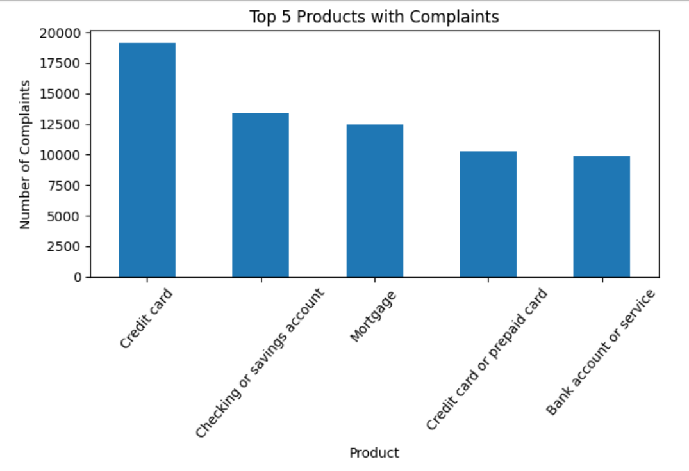
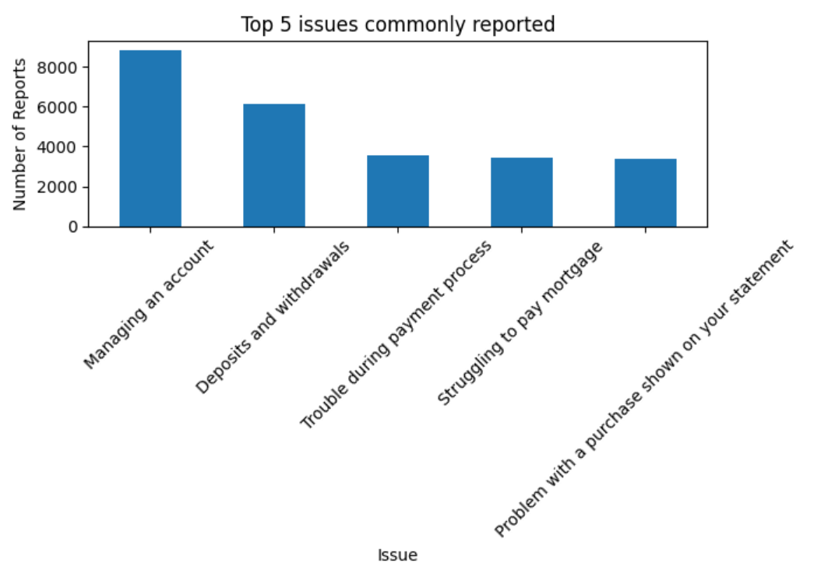

# Customer Complaint Analysis
## Introduction
This Analysis is to identify and understand consumers complaint and how to rectify them.
## Data
This dataset was gotten from [Kaggle](https://www.kaggle.com/). This dataset consists of 13 columns and 75513 rows. The kind of information found in the table includes:
Complaint Details, Product and Issue, Company Information, Consumer Information, Submission and Response.

I read the above info from the dataset using:

```import pandas as pd
df = pd.read_excel('Financial Consumer Complaints.xlsx')
df.head()
```

## Data Cleaning
I performed a data quality check to ensure it is clean and ready for analysis. These were the data issues I found and rectified.
1. **Incorrect Data Types:**

**To Find Incorrect Data Types:**

I used: ```df.dtypes``` to find the columns with incorrect data types as shown below:
```
Complaint ID                             int64
Date Sumbited                   datetime64[ns]
Product                                 object
Issue                                   object
Company                                 object
State                                   object
Consumer consent provided?              object
Submitted via                           object
Date Received                   datetime64[ns]
Response Time (Days)                     int64
Company response to consumer            object
Timely response?                        object
Consumer disputed?                      object
dtype: object
``` 
**To Rectify Incorrect Data Types**

I rectified the incorrect data types of the concerned columns by using the below:
```
df['Product'] = df['Product'].astype('string')
df['Issue'] = df['Issue'].astype('string')
df['Company'] = df['Company'].astype('string')
df['State'] = df['State'].astype('string')
df['Consumer consent provided?'] = df['Consumer consent provided?'].astype('bool')
df['Submitted via'] = df['Submitted via'].astype('string')
df['Company response to consumer'] = df['Company response to consumer'].astype('string')
df['Timely response?'] = df['Timely response?'].astype('bool')
df['Consumer disputed?'] = df['Consumer disputed?'].astype('bool')
df.dtypes
```
The correct Data types is shown below:
```
Complaint ID                             int64
Date Sumbited                   datetime64[ns]
Product                         string[python]
Issue                           string[python]
Company                         string[python]
State                           string[python]
Consumer consent provided?                bool
Submitted via                   string[python]
Date Received                   datetime64[ns]
Response Time (Days)                     int64
Company response to consumer    string[python]
Timely response?                          bool
Consumer disputed?                        bool
dtype: object
```
2. **Missing Values**

**To Find Missing Values:**

I used: ```df.isnull().sum()``` to find the columns with missing values as shown below:
```
Complaint ID                       0
Date Sumbited                      0
Product                            0
Issue                              0
Company                           18
State                           2893
Consumer consent provided?         0
Submitted via                      0
Date Received                      0
Response Time (Days)               0
Company response to consumer       0
Timely response?                   0
Consumer disputed?                 0
dtype: int64
```
**To Rectify Missing Values:**

I rectified the missing values of the concerned columns by using the below:
```
df[df['Company'].isnull()]
df.loc[df['Company'].isnull(), 'Company'] = 'unknown'
df.loc[df['State'].isnull(), 'State'] = 'unknown'
df.isnull().sum()
```
The rectified missing values are shown below:
```
Complaint ID                    0
Date Sumbited                   0
Product                         0
Issue                           0
Company                         0
State                           0
Consumer consent provided?      0
Submitted via                   0
Date Received                   0
Response Time (Days)            0
Company response to consumer    0
Timely response?                0
Consumer disputed?              0
dtype: int64
```
3. **Duplicate Rows**

**To Find Duplicate Rows**

I used: ```df[df.duplicated()]``` to find the duplicate rows.

**To Rectify Duplicate Rows**

I used: ```df.drop_duplicates(inplace = True)``` to rectify the duplicate rows.

 4. **Wrong Spelling**

 **To Find Wrong Spelling**

 I used: ```df['Submitted via'].drop_duplicates()``` to find wrong spelling on Submitted via column as shown below:
 ```
0                Web
2           Referral
11             Phone
17       Postal mail
27               Fax
443             Faxe
2646           Email
41060          Webbb
Name: Submitted via, dtype: string
```
**To Rectify Wrong Spelling**

I rectified the wrong spelling of the Submitted via columns by using the below:
```
df.loc[df['Submitted via'] == 'Webbb', 'Submitted via'] = 'Web'
df.loc[df['Submitted via'] == 'Faxe', 'Submitted via'] = 'Fax'
df['Submitted via'].drop_duplicates()
```
The rectified wrong spelling is shown below:
```
0               Web
2          Referral
11            Phone
17      Postal mail
27              Fax
2646          Email
Name: Submitted via, dtype: string
```

5. **Number of Rows and Colunms**

**To Find Number of Rows and Columns**

I used the below to get the know of rows and columns:
```
print(df.shape)
print(f"Number of rows: {df.shape[0]}")
print(f"Number of columns: {df.shape[1]}")
```

## Analysis and Insights
**1. What are the top 5 products customers have a complaint about?**

For analysis, I used the below:
```
df['Product'].value_counts().head(5)
```
Result:
```
Product
Credit card                    19176
Checking or savings account    13436
Mortgage                       12470
Credit card or prepaid card    10241
Bank account or service         9893
Name: count, dtype: Int64
```
To gain insight, I used the below to visualize:
```
import matplotlib.pyplot as plt
top_5_products = df['Product'].value_counts().head(5)

# Plot a bar chart
plt.figure(figsize=(7,5))
top_5_products.plot(kind='bar')
plt.title('Top 5 Products with Complaints')
plt.xlabel('Product')
plt.ylabel('Number of Complaints')
plt.xticks(rotation=50)
plt.tight_layout()
plt.show()
```


**2. What are the top 5 issues that are commonly reported?**

For analysis, I used the below:
```
df['Issue'].value_counts().head(5)
```
Result:
```
Issue
Managing an account                                8849
Deposits and withdrawals                           6127
Trouble during payment process                     3534
Struggling to pay mortgage                         3437
Problem with a purchase shown on your statement    3365
Name: count, dtype: Int64
```

To gain insight, I used the below:
```
top_5_issues = df['Issue'].value_counts().head(5)

# Plot a bar chart
plt.figure(figsize=(7,5))
top_5_issues.plot(kind='bar')
plt.title('Top 5 issues commonly reported')
plt.xlabel('Issue')
plt.ylabel('Number of Reports')
plt.xticks(rotation=45)
plt.tight_layout()
plt.show()
```


**3. Which submission channels are most commonly used for complaints?**

For analysis, I used the below:
```
df['Submitted via'].drop_duplicates()
```
Result:
```
0               Web
2          Referral
11            Phone
17      Postal mail
27              Fax
2646          Email
Name: Submitted via, dtype: string
```
To gain insight, I used the below:
```
# Plot a pie chart
submission_channels = df['Submitted via'].value_counts()

plt.figure(figsize=(10,5))
plt.pie(submission_channels, labels=submission_channels.index, autopct='%1.0f%%')
plt.title('Submission Channels for Complaints')
plt.show()
```
**4. Which submission channels have the highest non timely response?**

For analysis, I used the below:
```
# Find the average response time for each submission channel and sort the result.
df.groupby('Submitted via')['Response Time (Days)'].mean().sort_values(ascending=False).round(2)
```
To gain insight, I used the below:
```
# Plot a Seaborn Bar Chart
import seaborn as sns
avg_response_time = df.groupby('Submitted via')['Response Time (Days)'].mean().sort_values(ascending=False).round(2)

plt.figure(figsize=(6,4))
sns.barplot(x=avg_response_time.index, y=avg_response_time.values)
plt.title('Average Response Time by Submission Channel')
plt.xlabel('Submission Channel')
plt.ylabel('Average Response Time (Days)')
plt.xticks(rotation=45)
plt.tight_layout()
plt.show()
```
**5. What are the top 3 issues the consumers disputed the most?**

For analysis, I used the below:
```
df['Issue'].value_counts().head(3)
```
To gain insight, I used the below:
```
# Plot a Pie Chart:

top_3_issues = df['Issue'].value_counts().head(3)

plt.figure(figsize=(10,6))
plt.pie(top_3_issues, labels=top_3_issues.index, autopct='%1.1f%%')
plt.title('Top 3 Issues Disputed by Consumers')
plt.show()
```
**6. Which state did most of the complaints come from?**

For analysis, I used the below:
```
df['State'].value_counts().head(1)
```
To gain insight, I used the below:
```
top_state = df['State'].value_counts().head(5)

plt.figure(figsize=(6,4))
top_state.plot(kind='bar')
plt.title('State with the Most Complaints')
plt.xlabel('State')
plt.ylabel('Number of Complaints')
plt.xticks(rotation=45)
plt.tight_layout()
plt.show()
```
